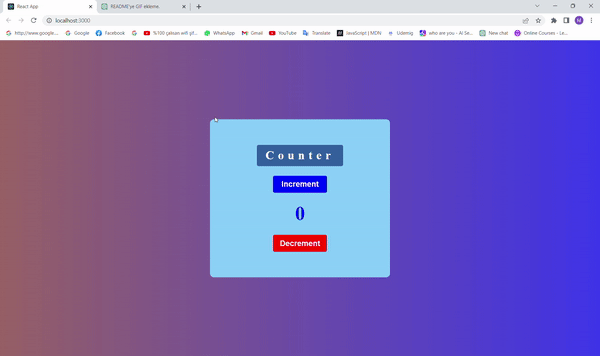

# Redux Toolkit Counter App

This is a simple counter app built using Redux Toolkit. The app allows you to increment and decrement a counter using the + and - buttons respectively.

<h2>Getting Started</h2>

These instructions will get you a copy of the project up and running on your local machine.

<h3>Prerequisites</h3>

Before you begin, ensure you have the following installed on your machine:

<ul>
 <li>Node.js</li>
 <li>npm (Node Package Manager)</li>
</ul>

<h3>Installing</h3>

 1. Clone the repository to your local machine:

<ul>
  <li>git clone https://github.com/mhmtkarakas/redux-toolkit-counter-app.git</li>  
</ul>

 2. Navigate to the project directory:

<ul>
  <li>cd redux-toolkit-counter-app</li>  
</ul>
   
 3. Install dependencies:

<ul>
  <li>npm install</li>  
</ul>

 4. Start the app:

<ul>
  <li>npm start</li>  
</ul>

 5. Open your browser and go to http://localhost:3000 to view the app.

<h3>Usage</h3>

  
To increment the counter, click the + button. To decrement the counter, click the - button.

<h3>Built With</h3>

   1. React - JavaScript library for building user interfaces
   2. Redux Toolkit - Opinionated, batteries-included toolset for efficient Redux development

<h3>Acknowledgments</h3>
    
   <ul>
     <li>This app was created as part of a Redux Toolkit tutorial</li>
   </ul>
 
 <h3>ScreenGif</h3>

  
